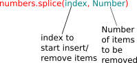

# JavaScript: Data Structures & Algorithms Notes

These are my notes created while reading the book [Learning JavaScript Data Structures and Algorithms]() by [Loiane Groner](), which has got my attention or are important to learn implementation of Data Structures and Algorithms using JavaScript.
You can always use these for your study purposes.

### Chapter 2: Arrays

> The **push** and **pop** methods allow an array to emulate a basic **stack** data structure.

> The **shift** and **unshift** methods allow an array to emulate a basic **queue** data structure,

- **splice()**
	- **Removing**: We can use the splice method to remove an element from an array by simply specifying the position/index we would like to delete from and how many elements we would like to remove.

	 

	- **Inserting**: For eg: `numbers.splice(5,0,2,3,4);`

	  The first argument of the method is the index we want to remove or insert elements from. The second argument is the number of elements we want to remove (in this case, we do not want to remove any, so we pass the value 0 (zero)). And the third argument (and onwards) are the values we would like to insert into the array (elements 2, 3, and 4).

- **sort()**

	Example: 
	```javascript
	numbers.sort(function(a,b){
			   return a-b;
			}); 
	```
	This code will return a negative number if b is bigger than a , a positive number if a is bigger than b , and zero if they are equal. This means that if a negative value is returned, it implies that a is smaller than b , which is further used by the sort function to arrange the elements.

	For accented characters, we can use the localeCompare method as well:
	```javascript
	var names2 = ['Maève', 'Maeve'];
	console.log(names2.sort(function(a, b){
	return a.localeCompare(b);
	}));
	```
	And the output will be `["Maeve", "Maève"]`.

- **More Resources**:
	>There are also great libraries that are very useful when working with arrays in JavaScript projects:
	- *The Underscore library*: [http://underscorejs.org/](http://underscorejs.org/)
	- *The Lo-Dash library*: [http://lodash.com/](http://lodash.com/)


#### References for JavaScript array methods:

|Method 	    | Description							|
|---------------|---------------------------------------|
|	concat		|	Joins multiple arrays and returns a copy of the joined arrays|
|	every		|	Calls a function for every element of the array until false is returned	|
|	filter		|	Creates an array with each element that evaluates to true in the function provided|
|	forEach		|   Joins all the array elements into a string|
|	indexOf	    |	Searches the array for specific elements and returns its position|
|	lastIndexOf	|	Returns the last item in the array that matches the search criteria and returns its position|
|	map		    |	Creates a new array with the result of calling the specified function on each element of the array|
|	reverse		|	Reverses the array so the last items become the first and vice versa|
|	slice		|   Returns a new array from the specified index|
|	some		|   Passes each element through the supplied function until true is returned|
|	sort		|	Sorts the array alphabetically or by the supplied function|
|	toString		|	Returns the array as a string|
|	valueOf		|	Like the method toString, this returns the array as a string|

